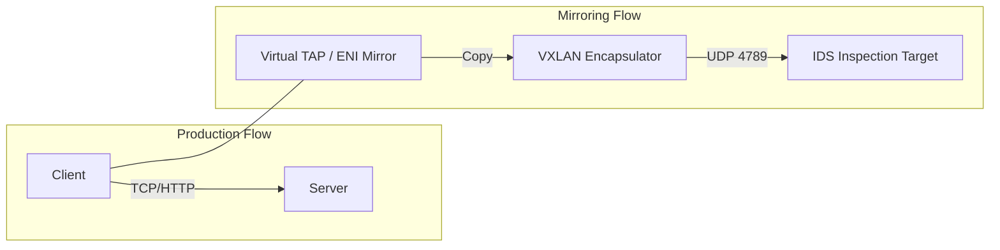
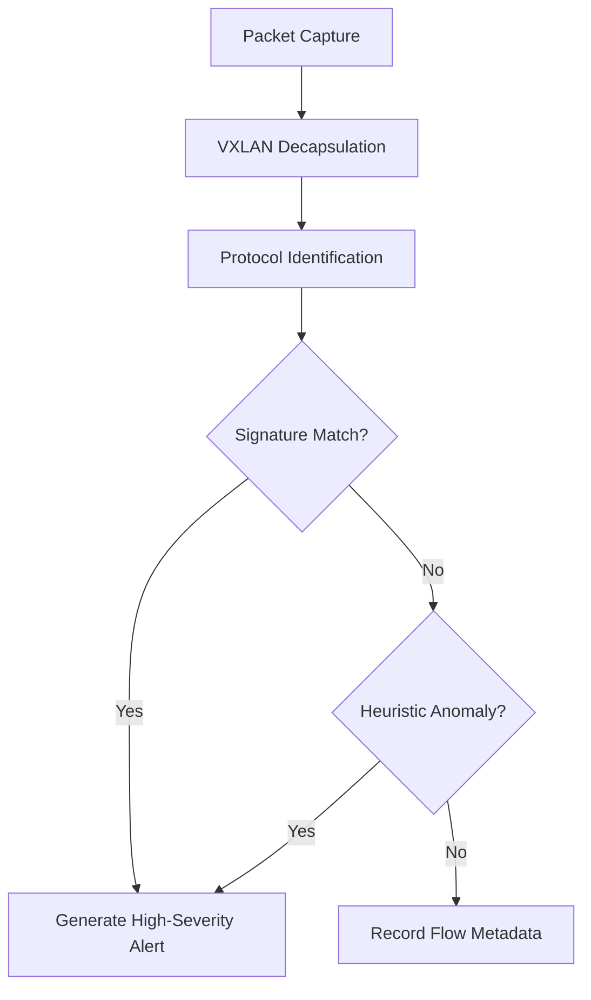
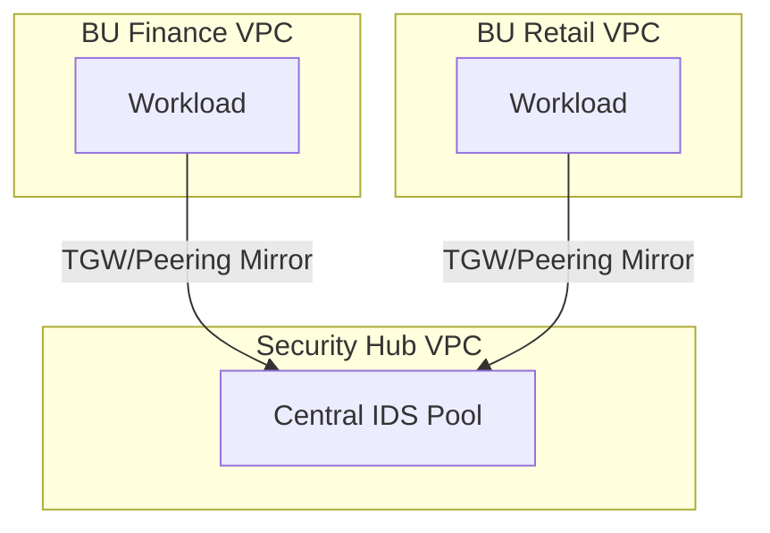
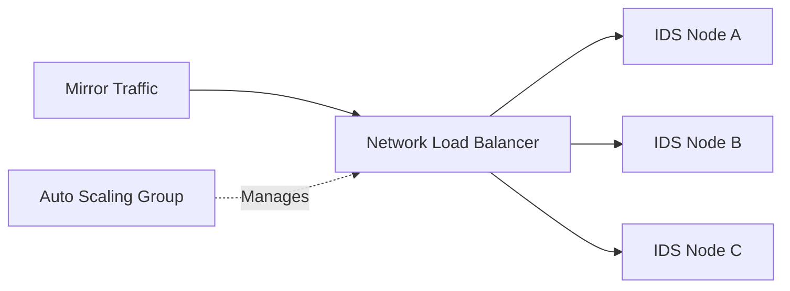
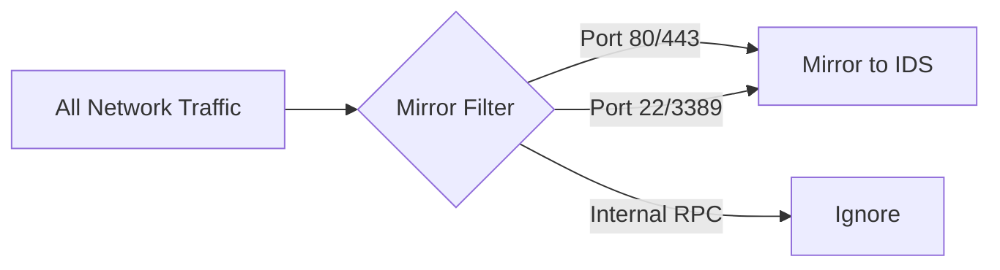
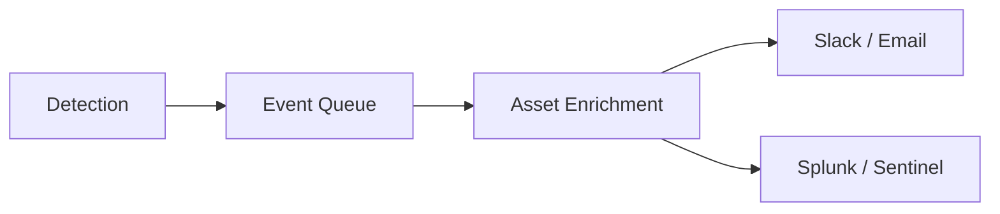
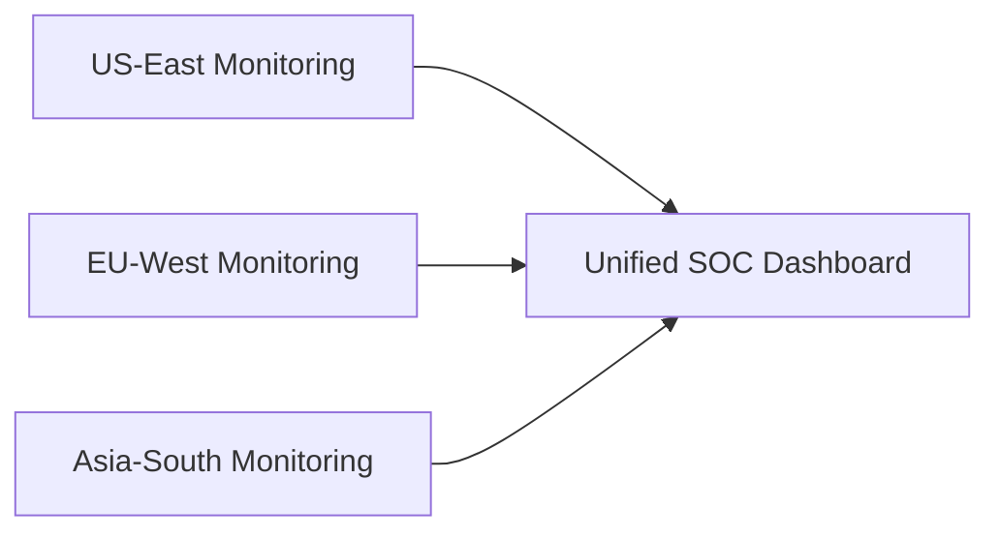
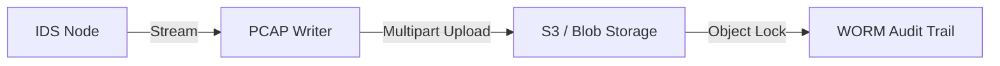
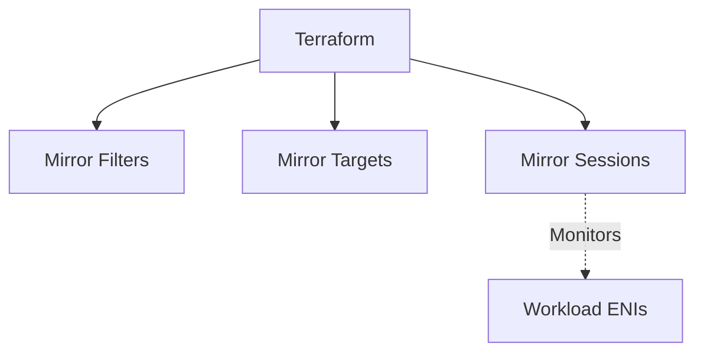

<div align="center">


<h1>Traffic Mirroring for IDS</h1>

<p><strong>The Institutional-Grade Platform for Standardized Network Visibility, Intrusion Detection Governance, and Multi-Cloud Threat Ecosystems.</strong></p>

[]()
[]()
[]()

<br/>

> **"Industrializing network visibility to automate threat foundations."** 
> **Traffic Mirroring for IDS** is an enterprise-grade platform designed to provide a secure, measurable, and highly automated foundation for global network security operations. It orchestrates the complex lifecycle of traffic inspection—from automated packet mirroring and multi-cloud signature reconciliation to high-throughput detection intelligence and unified security auditing.

</div>

---

## 🏛️ Executive Summary

Fragmented network visibility and manual IDS orchestration are strategic operational liabilities; lack of a standardized traffic mirroring framework is a primary barrier to organizational engineering maturity. Organizations fail to detect sophisticated breaches not because of a lack of tools, but because of fragmented evaluation standards, lack of automated signature reconciliation, and an inability to orchestrate visibility planes with operational precision.

This platform provides the **Network Threat Visibility Plane**. It implements a complete **Traffic-Mirroring-as-Code Framework**, enabling CISO teams and Security Architects to manage global network foundations as first-class citizens. By automating the identification of architectural blind spots through real-time telemetry analysis and orchestrating the provisioning of secure performance-driven mirroring policies, we ensure that every organizational workload—from core application VPCs to edge serverless subnets—is monitored by default, audited for history, and strictly aligned with institutional security frameworks.

---

## 📐 Architecture Storytelling: Principal Reference Models

### 1. Principal Architecture: Cloud-Native Traffic Inspection Hub & Visibility Plane
This diagram illustrates the high-level relationship between the Source Workload Zone, the Traffic Mirroring Orchestrator, and the Centralized Inspection Hub. It defines the bridge between network traffic and real-time security intelligence.

```mermaid
graph LR
    %% Subgraph Definitions
    subgraph SourceZone["Source Workload Zone"]
        direction TB
        App1[App Instance A]
        App2[App Instance B]
        ENI1[Source ENI]
        ENI2[Source ENI]
    end

    subgraph MirrorOrchestration["Traffic Mirroring Orchestrator"]
        direction TB
        Session[Mirror Session]
        Filter[Protocol/Port Filter]
        Target[Mirror Target (NLB)]
    end

    subgraph InspectionVPC["Centralized Inspection VPC (Hub)"]
        direction TB
        IDSFleet[Auto-Scaling IDS Fleet]
        Suricata[Suricata / Zeek Engine]
        PCAP[Forensic PCAP Writer]
    end

    subgraph IntelligencePlane["Security Intelligence Plane"]
        direction TB
        API[FastAPI Security Gateway]
        Engine[Anomaly Detection Hub]
        AlertHub[Alert Orchestrator]
        DB[(Postgres: Forensic DB)]
    end

    subgraph SOC["Security Operations Center"]
        direction TB
        Dash[Real-time SOC Dashboard]
        SIEM[SIEM / Splunk Integration]
        Notify[Slack / PagerDuty Alerts]
    end

    subgraph DevOps["DevOps & IaC Automation"]
        direction TB
        GH[GitHub Actions]
        TF[Terraform Mirroring Modules]
        Policy[Azure/AWS Network Policy]
    end

    %% Flow Arrows
    App1 --- ENI1
    App2 --- ENI2
    ENI1 -->|Mirror| Session
    ENI2 -->|Mirror| Session
    Session -->|Encapsulated (VXLAN)| Filter
    Filter -->|Validated| Target
    Target -->|Balance| IDSFleet
    IDSFleet -->|Inspect| Suricata
    Suricata -->|Alert Event| API
    
    API -->|Analyze| Engine
    Engine -->|Store| DB
    DB -->|Visualize| Dash
    
    API -->|Dispatch| AlertHub
    AlertHub -->|Forward| SIEM
    AlertHub -->|Notify| Notify
    
    GH -->|Provision| TF
    TF -->|Orchestrate| MirrorOrchestration

    %% Styling
    classDef source fill:#f5f5f5,stroke:#616161,stroke-width:2px;
    classDef mirror fill:#fff3e0,stroke:#e65100,stroke-width:2px;
    classDef inspect fill:#e8f5e9,stroke:#1b5e20,stroke-width:2px;
    classDef intel fill:#ede7f6,stroke:#311b92,stroke-width:2px;
    classDef soc fill:#fce4ec,stroke:#880e4f,stroke-width:2px;
    classDef devops fill:#fffde7,stroke:#f57f17,stroke-width:2px;

    class SourceZone source;
    class MirrorOrchestration mirror;
    class InspectionVPC inspect;
    class IntelligencePlane intel;
    class SOC soc;
    class DevOps devops;
```

### 2. The Visibility Lifecycle Flow (Mirroring & Inspection)
The continuous path of a network packet from source ENI capture and VXLAN encapsulation to real-time signature matching and heuristic anomaly detection. This ensures zero-interruption operations through dependency-aware traffic flows.



**IDS Inspection Pipeline:**


### 3. Distributed Visibility Topology (Hub-and-Spoke & Scaling)
Strategically orchestrating standardized inspection across global regions and multi-tenant VPCs (Finance, Retail), providing a unified institutional view of network threat surfaces.



**Auto-Scaling IDS Fleet:**


### 4. Governance Hub & Alert Control Plane
Executing complex logic for securing the bridge between network traffic and the SOC, ensuring every mirror filter is optimized, detections are enriched, and alerts are dispatched to the SIEM.



**Threat Alert Lifecycle:**


### 5. Multi-Cloud Visibility Federation (Global SOC)
Automatically managing unified visibility standards across global regions (US, EU, Asia) and diverse cloud tenants, ensuring institutional data residency and privacy boundaries by default.



### 6. Encryption & Perimeter Protection Flow (Forensic Analysis)
Managing the lifecycle of a packet capture, automatically enforcing institutional S3 object locking and encryption standards as required by security policy, ensuring zero-latency evidence confidence.



### 7. Institutional Visibility Maturity Scorecard (SOC Dashboard)
Grading organizational performance based on key indicators: Detection Latency, Threat Capture Index, and Visibility Adoption Scores across all business units.

### 8. Identity & RBAC for Visibility Governance
Managing fine-grained access to inspection hubs and alert metadata between Security Teams, Incident Responders, and automated SIEM principals.

### 9. IaC Deployment: Mirroring-as-Code Framework
Using modular Terraform pipelines to deploy and manage the versioned distribution of mirroring filters, sessions, and inspection load balancers.



### 10. AIOps Visibility Drift & Risk Validation Flow
Using advanced analytics to identify sudden surges in traffic throughput, unauthorized filter changes, or unusual delivery pattern changes that could result in institutional risk or visibility failure.

### 11. Metadata Lake for Forensic Visibility Audit
Storing long-term records of every mirroring integration event (metadata), every detection executed, and every raw PCAP stream for institutional record-keeping and forensic analysis.

---

## 🏛️ Core Governance Pillars

1.  **Unified Foundation Coordination**: Maximizing resilience by centralizing all visibility measurement through a single institutional plane.
2.  **Automated Mirroring Provisioning**: Eliminating "manual tracking" scenarios through proactive orchestration and pattern verification.
3.  **Sequential Visibility Intelligence**: Ensuring zero-interruption operations through dependency-aware inspection-driven data engineering.
4.  **Zero-Trust Identity Protection**: Automatically enforcing identity-based access, PCAP encryption, and policy evaluation across all assurance tiers.
5.  **Autonomous Operations Logic**: Guaranteeing reliability through automated industry-specific effectiveness monitoring runbooks.
6.  **Full Visibility Auditability**: Immutable recording of every detection change and visibility provision for institutional forensics.

---

## 🛠️ Technical Stack & Implementation

### Visibility Engine & APIs
*   **Framework**: Python 3.11+ / FastAPI.
*   **Performance Engine**: Custom Python-based logic for multi-cloud signature reconciliation and DORA-style visibility metrics.
*   **IDS Core**: Suricata (Signature Matching) and Zeek (Metadata Extraction).
*   **Persistence**: PostgreSQL (Visibility Ledger) and Redis (Live Detection State).
*   **Auth Orchestrator**: Federated OIDC/SAML for least-privilege visibility management access.

### Governance Dashboard (UI)
*   **Framework**: React 18 / Vite.
*   **Theme**: Dark, Slate, Indigo (Modern high-fidelity productivity aesthetic).
*   **Visualization**: D3.js for delivery topologies and Recharts for ROI velocity analytics.

### Infrastructure & DevOps
*   **Runtime**: AWS EKS or Azure Kubernetes Service (AKS) for management plane.
*   **Measurement Hub**: Managed event sourcing for immutable productivity timeline reconstruction.
*   **IaC**: Modular Terraform for deploying the visibility landing zone and validation fleet.

---

## 🏗️ IaC Mapping (Module Structure)

| Module | Purpose | Real Services |
| :--- | :--- | :--- |
| **`infrastructure/visibility_hub`** | Central management plane | EKS, PostgreSQL, Redis |
| **`infrastructure/enforcers`** | Distributed mirror provisioners | Azure, AWS, GCP APIs |
| **`infrastructure/packet_pipes`** | Data Ingestion Hubs | Webhooks, Lambda |
| **`infrastructure/auditing`** | Forensic modernization sinks | S3, Athena, Quicksight |

---

## 🚀 Deployment Guide

### Local Principal Environment
```bash
# Clone the Traffic Mirroring for IDS repository
git clone https://github.com/devopstrio/traffic-mirroring-for-ids.git
cd traffic-mirroring-for-ids

# Configure environment
cp .env.example .env

# Launch the Visibility stack
make init

# Trigger a mock visibility update and automated guardrail validation simulation
make simulate-visibility
```

Access the SOC Dashboard at `http://localhost:3000`.

---

## 📜 License
Distributed under the MIT License. See `LICENSE` for more information.

---
<div align="center">
  <p>© 2026 Devopstrio. All rights reserved.</p>
</div>
