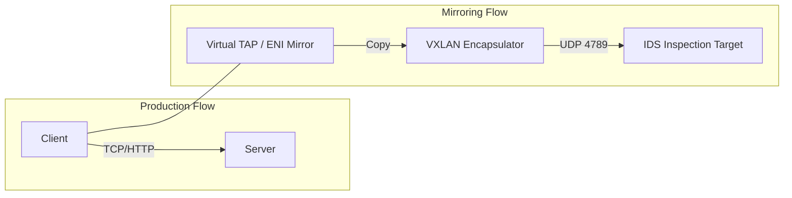
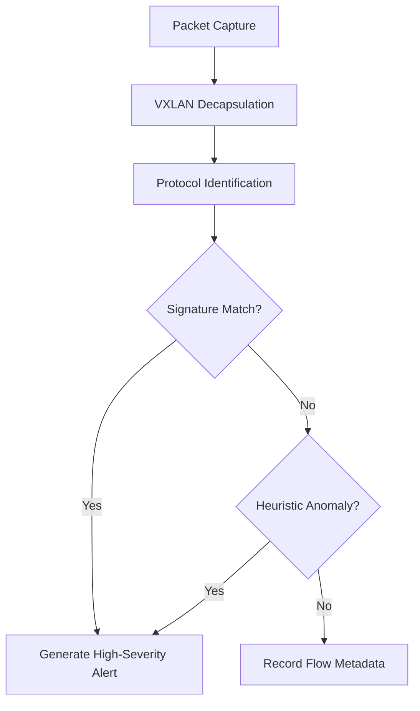
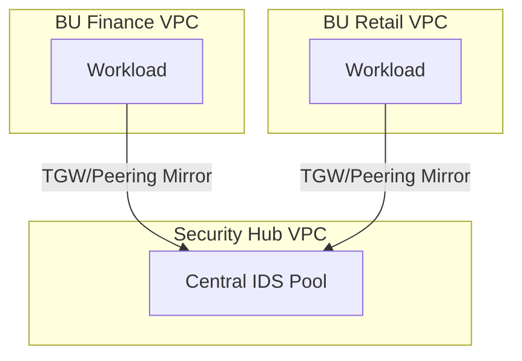
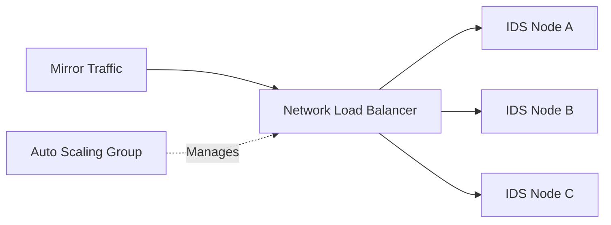
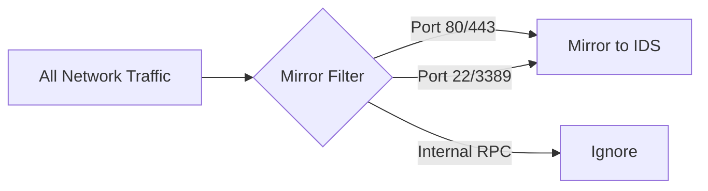
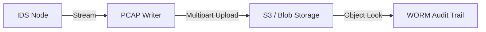
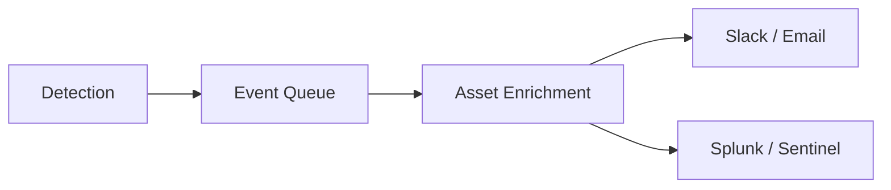
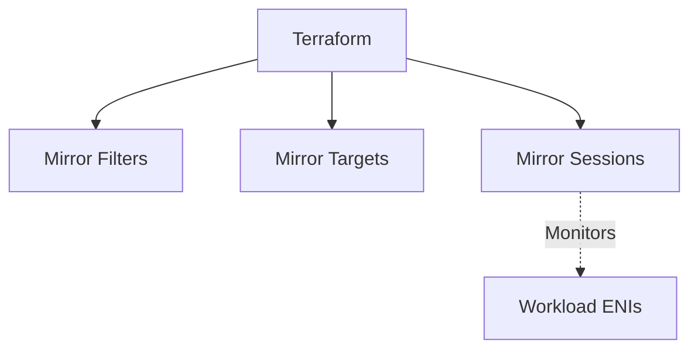
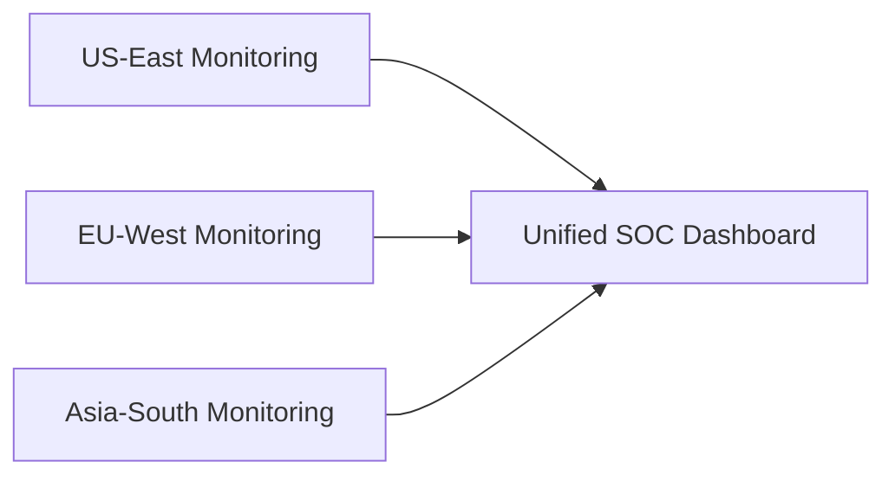

<div align="center">


<h1>Traffic Mirroring for IDS</h1>

<p><strong>The Enterprise-Grade Platform for Network Traffic Duplication, Real-Time Intrusion Detection, and Forensic Analysis.</strong></p>

[]()
[]()
[]()

<br/>

> **"Visibility is the foundation of defense."** 
> **Traffic Mirroring for IDS (Mirror-IDS)** is an institutional-grade platform designed to provide a secure, measurable, and highly automated foundation for global network threat detection. It orchestrates the entire lifecycle—from packet duplication and routing to real-time signature-based analysis.

</div>

---

## 🏛️ Executive Summary

Network threats are becoming increasingly sophisticated; a lack of visibility into inter-VPC and inter-subnet traffic is a strategic security gap. Organizations often fail to detect breaches not because of a lack of tools, but because of fragmented monitoring standards and an inability to analyze mirrored streams with operational precision.

This platform provides the **Network Threat Visibility Plane**. It implements a complete **Enterprise Traffic Mirroring Framework**, enabling security teams to treat network inspection as code. By automating the duplication and analysis phases, we eliminate blind spots and ensure rapid incident response across the entire enterprise ecosystem.

---

## 📐 Architecture Storytelling: Principal Reference Models

### 1. Principal Architecture: Cloud-Native Traffic Inspection Hub
This diagram illustrates the end-to-end flow from source traffic mirroring to real-time intrusion detection and SOC alerting.

```mermaid
graph LR
    %% Subgraph Definitions
    subgraph SourceZone["Source Workload Zone"]
        direction TB
        App1[App Instance A]
        App2[App Instance B]
        ENI1[Source ENI]
        ENI2[Source ENI]
    end

    subgraph MirrorOrchestration["Traffic Mirroring Orchestrator"]
        direction TB
        Session[Mirror Session]
        Filter[Protocol/Port Filter]
        Target[Mirror Target (NLB)]
    end

    subgraph InspectionVPC["Centralized Inspection VPC (Hub)"]
        direction TB
        IDSFleet[Auto-Scaling IDS Fleet]
        Suricata[Suricata / Zeek Engine]
        PCAP[Forensic PCAP Writer]
    end

    subgraph IntelligencePlane["Security Intelligence Plane"]
        direction TB
        API[FastAPI Security Gateway]
        Engine[Anomaly Detection Hub]
        AlertHub[Alert Orchestrator]
        DB[(Postgres: Forensic DB)]
    end

    subgraph SOC["Security Operations Center"]
        direction TB
        Dash[Real-time SOC Dashboard]
        SIEM[SIEM / Splunk Integration]
        Notify[Slack / PagerDuty Alerts]
    end

    subgraph DevOps["DevOps & IaC Automation"]
        direction TB
        GH[GitHub Actions]
        TF[Terraform Mirroring Modules]
        Policy[Azure/AWS Network Policy]
    end

    %% Flow Arrows
    App1 --- ENI1
    App2 --- ENI2
    ENI1 -->|Mirror| Session
    ENI2 -->|Mirror| Session
    Session -->|Encapsulated (VXLAN)| Filter
    Filter -->|Validated| Target
    Target -->|Balance| IDSFleet
    IDSFleet -->|Inspect| Suricata
    Suricata -->|Alert Event| API
    
    API -->|Analyze| Engine
    Engine -->|Store| DB
    DB -->|Visualize| Dash
    
    API -->|Dispatch| AlertHub
    AlertHub -->|Forward| SIEM
    AlertHub -->|Notify| Notify
    
    GH -->|Provision| TF
    TF -->|Orchestrate| MirrorOrchestration

    %% Styling
    classDef source fill:#f5f5f5,stroke:#616161,stroke-width:2px;
    classDef mirror fill:#fff3e0,stroke:#e65100,stroke-width:2px;
    classDef inspect fill:#e8f5e9,stroke:#1b5e20,stroke-width:2px;
    classDef intel fill:#ede7f6,stroke:#311b92,stroke-width:2px;
    classDef soc fill:#fce4ec,stroke:#880e4f,stroke-width:2px;
    classDef devops fill:#fffde7,stroke:#f57f17,stroke-width:2px;

    class SourceZone source;
    class MirrorOrchestration mirror;
    class InspectionVPC inspect;
    class IntelligencePlane intel;
    class SOC soc;
    class DevOps devops;
```

### 2. Traffic Flow: Packet Mirroring & VXLAN Encapsulation
The low-level mechanics of duplicating packets without impacting production latency.



### 3. IDS Inspection Pipeline: From Packet to Alert
The logical stages of the Intrusion Detection System engine.



### 4. Centralized Inspection: Hub-and-Spoke Topology
Scaling traffic mirroring across multiple VPCs and Business Units.



### 5. Scaling the Fleet: NLB & Auto-Scaling IDS
Ensuring high-availability for deep packet inspection.



### 6. Mirror Filter Logic: Strategic Visibility
Enforcing specific filters to optimize inspection costs and focus.



### 7. Forensic Analysis: Immutable PCAP Storage
Capturing raw evidence for incident post-mortems and compliance.



### 8. Threat Alert Lifecycle: SOC Integration
The journey of a detection from the network to the responder.



### 9. IaC Orchestration: Mirroring-as-Code
Deploying the entire visibility stack using Terraform modules.



### 10. Global SOC: Multi-Region Visibility
Unified dashboarding for a globally distributed network.



---

## 🏛️ Core Platform Pillars

1.  **Traffic Mirroring Engine**: High-performance duplication of network packets from source ENIs to dedicated inspection targets.
2.  **IDS Integration Hub**: Carrier-grade engine for signature-based threat detection (Suricata/Zeek).
3.  **Forensic Analysis Pipeline**: Real-time stream processing of mirrored traffic for anomaly detection.
4.  **Mirroring-as-Code Policies**: Versioned, code-driven enforcement of mirroring filters.
5.  **Unified SOC Dashboard**: Deep monitoring of traffic throughput, threat alerts, and IDS health.
6.  **Network Governance Framework**: Policy-driven enforcement of compliance standards (PCI-DSS, NIST).

---

## 🛠️ Technical Stack & Implementation

### Platform Engine & APIs
*   **Framework**: Python 3.11+ / FastAPI.
*   **IDS Core**: Suricata for signature matching and Zeek for metadata extraction.
*   **Packet Handling**: Libpcap / AF_PACKET for high-speed capture.
*   **State Management**: PostgreSQL (Alerts) and Redis (Event Streaming).

### SOC Dashboard
*   **Framework**: React 18 / Vite.
*   **Theme**: Indigo / Emerald (Modern Security & NOC aesthetic).
*   **Visualization**: Recharts for throughput trends and alert severity.

### Infrastructure
*   **Runtime**: AWS EKS or Azure Kubernetes Service (AKS).
*   **IaC**: Modular Terraform for VPC Mirroring and NLB orchestration.

---

## 🏗️ IaC Mapping (Module Structure)

| Module | Purpose | Real Services |
| :--- | :--- | :--- |
| **`infrastructure/mirroring`** | Taps, Sessions, and Filters | VPC Traffic Mirroring |
| **`infrastructure/inspection`** | IDS Fleet and Load Balancers | EKS, NLB, Suricata Nodes |
| **`infrastructure/forensics`** | Packet storage and analysis | S3, Athena, Kinesis |
| **`infrastructure/soc`** | Alerting and Dashboarding | Lambda, SNS, React Hub |

---

## 🚀 Deployment Guide

### Local Principal Environment
```bash
# Clone the repository
git clone https://github.com/devopstrio/traffic-mirroring-for-ids.git
cd traffic-mirroring-for-ids

# Setup environment
cp .env.example .env

# Launch the Visibility stack
make up

# Seed initial traffic patterns
make seed

# Run the detection validation suite
make test
```

Access the SOC Dashboard at `http://localhost:3000`.

---

## 📜 License
Distributed under the MIT License. See `LICENSE` for more information.

---
<div align="center">
  <p>© 2026 Devopstrio. All rights reserved.</p>
</div>
