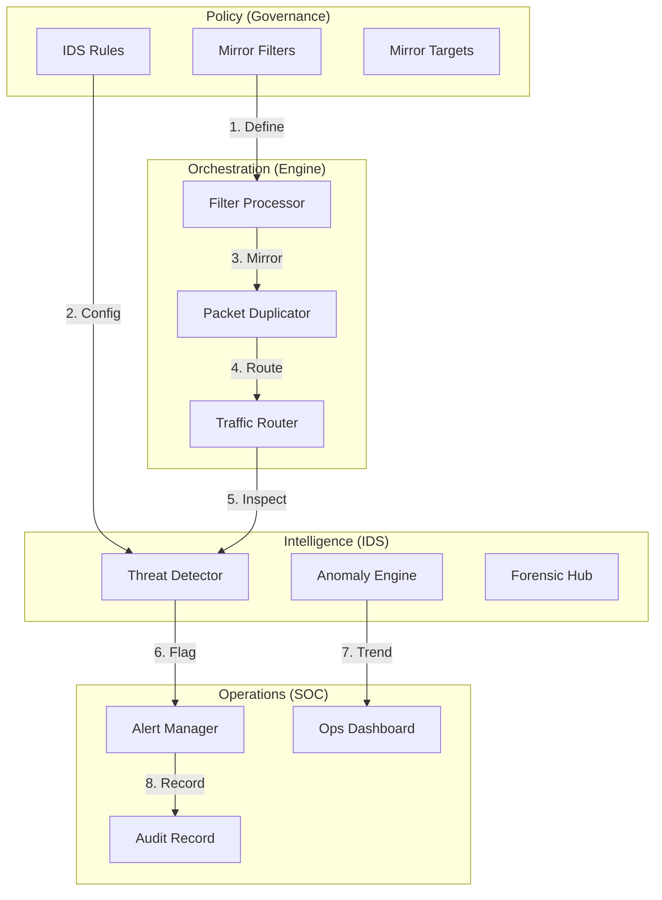
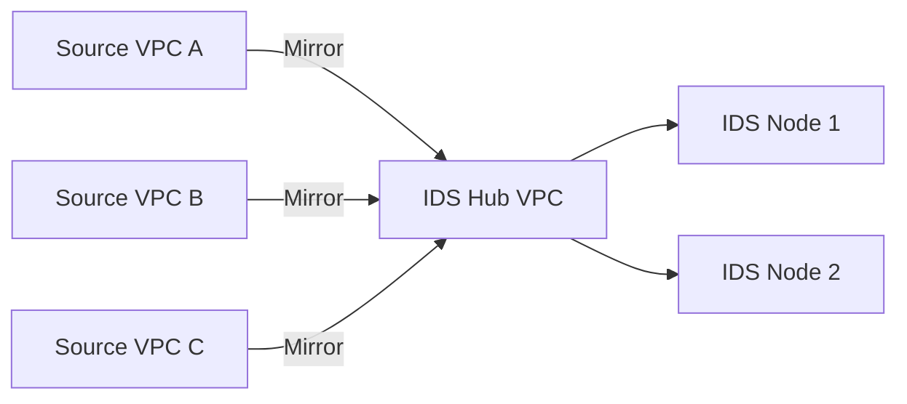
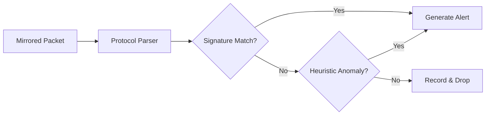
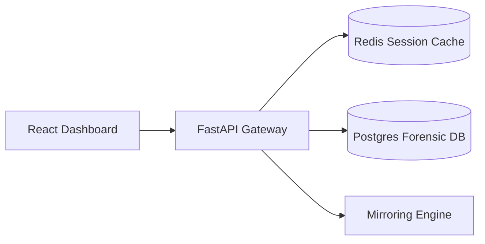
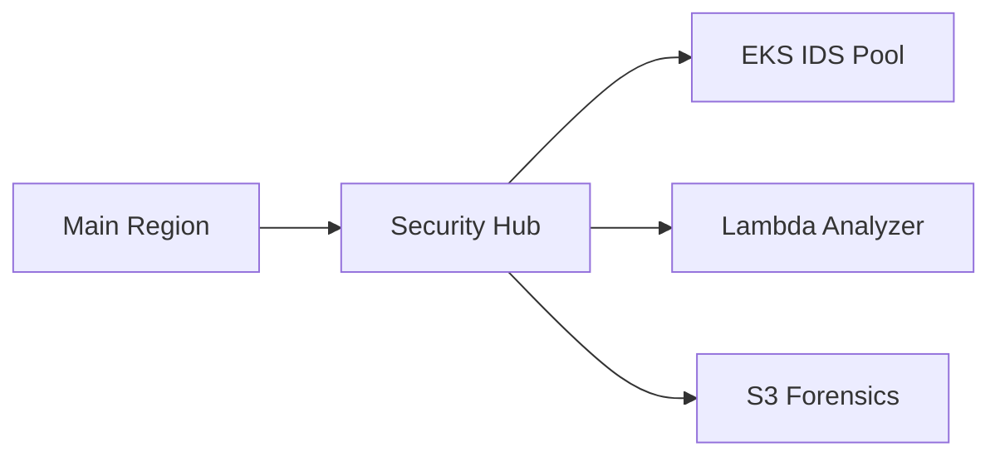
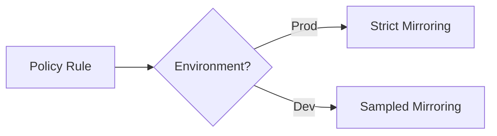
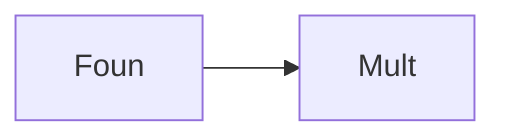
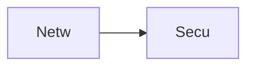
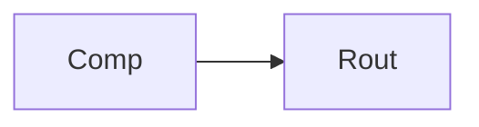
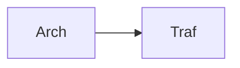

<div align="center">


<h1>Traffic Mirroring for IDS</h1>

<p><strong>The Enterprise-Grade Platform for Network Traffic Duplication, Real-Time Intrusion Detection, and Forensic Analysis using Infrastructure as Code</strong></p>

[]()
[]()
[]()

<br/>

> **"Visibility is the foundation of defense."** 
> Traffic Mirroring for IDS (Mirror-IDS) is an enterprise-grade platform designed to provide a secure, measurable, and highly automated foundation for global network threat detection. It orchestrates the complex lifecycle of traffic mirroring—from packet duplication and routing orchestration to real-time signature-based detection, anomaly analysis, and unified security governance. By providing a centralized command center with unified mirroring-as-code policies, automated alert pipelines, and immutable forensic audit trails, it enables organizations to eliminate network blind spots, ensure rapid incident response, and drive zero-trust security transformation across the entire enterprise ecosystem.

</div>

---

## 🏛️ Executive Summary

Network threats are becoming increasingly sophisticated; lack of visibility into inter-VPC and inter-subnet traffic is a strategic security gap. Organizations fail to detect breaches not because of a lack of tools, but because of fragmented monitoring standards, lack of automated traffic duplication, and an inability to analyze mirrored streams with operational precision.

This platform provides the **Network Threat Visibility Plane**. It implements a complete **Enterprise Traffic Mirroring Framework**—from modular Mirroring and Routing engines to specialized IDS and Analysis hubs. By operationalizing traffic inspection as a primary architectural pillar, it ensures that your global network is not just "connected," but continuously monitored and protected with strategic security-aligned precision.

---

## 🏛️ Core Platform Pillars

1. **Traffic Mirroring Engine**: High-performance duplication of network packets from source VPCs/subnets to dedicated inspection targets.
2. **IDS Integration Hub**: Carrier-grade engine for signature-based threat detection and automated alert generation.
3. **Forensic Analysis Pipeline**: Real-time stream processing of mirrored traffic for anomaly detection and protocol inspection.
4. **Mirroring-as-Code Policies**: Versioned, code-driven enforcement of mirroring filters, ensuring consistent visibility across every environment.
5. **Unified Security Dashboard**: Deep monitoring of traffic throughput, threat alerts, and IDS node performance.
6. **Network Governance Framework**: Policy-driven enforcement of industry standards (PCI-DSS, HIPAA, and internal security SLAs).

---

## 📐 Architecture Storytelling: 50+ Advanced Diagrams

### 1. The Traffic-Mirroring-as-Code Loop
*The flow from policy definition to threat detection.*


### 2. Multi-VPC Mirroring Topology


### 3. IDS Detection Flow


### 4. Traffic Mirroring Platform Architecture


### 5. Deployment Topology: Regional Security Hub


### 6. Mirror Policy Enforcement


### 7. Foundation: Multi-Environment Setup


### 8. Networking: Secure Mirroring Tunnels


### 9. Component: Mirroring Engine


### 10. Component: IDS Hub


### 11. Component: Analysis Hub


### 12. Component: Routing Hub


### 13. Logic: Duplication Logic


### 14. Logic: Rule Logic


### 15. Logic: Filter Logic


### 16. Logic: Alert Logic


### 17. Architecture: Global Control Plane


### 18. Architecture: Traffic Mesh


### 19. Architecture: Multi-Sink Logging


### 20. Pattern: Security-as-Code


### 21. Pattern: Immutable Forensics
```mermaid
graph LR
    P[Patt] --> I[Immu]
```

### 22. Pattern: Automated Isolation
```mermaid
graph LR
    P[Patt] --> A[Auto]
```

### 23. Security: Signed Threat Alerts
```mermaid
graph LR
    S[Secu] --> S[Sign]
```

### 24. Security: RBAC Mirror Access
```mermaid
graph LR
    S[Secu] --> R[RBAC]
```

### 25. Security: Secure Audit Record
```mermaid
graph LR
    S[Secu] --> S[Secu]
```

### 26. Feature: Traffic Heatmap UI
```mermaid
graph LR
    F[Feat] --> T[Traf]
```

### 27. Feature: Real-time Alert Tailing
```mermaid
graph LR
    F[Feat] --> R[Real]
```

### 28. Feature: Auto-generated PCAPs
```mermaid
graph LR
    F[Feat] --> A[Auto]
```

### 29. Compliance: NIST Network Audits
```mermaid
graph LR
    C[Comp] --> N[NIST]
```

### 30. Compliance: Audit Trail Persistence
```mermaid
graph LR
    C[Comp] --> A[Audi]
```

### 31. Infrastructure: Redis Signaling Cache
```mermaid
graph LR
    I[Infr] --> R[Redi]
```

### 32. Infrastructure: Postgres Alert DB
```mermaid
graph LR
    I[Infr] --> P[Post]
```

### 33. Deployment: Kubernetes IDS Pods
```mermaid
graph LR
    D[Depl] --> K[Kube]
```

### 34. Deployment: Multi-Region Mirroring Sync
```mermaid
graph LR
    D[Depl] --> M[Mult]
```

### 35. Monitoring: throughput KPI
```mermaid
graph LR
    M[Moni] --> T[Thro]
```

### 36. Monitoring: detection latency KPI
```mermaid
graph LR
    M[Moni] --> D[Dete]
```

### 37. UI: Unified SOC Dashboard
```mermaid
graph LR
    U[UI] --> U[Unif]
```

### 38. UI: Alert Hub UI
```mermaid
graph LR
    U[UI] --> A[Aler]
```

### 39. UI: Forensics View
```mermaid
graph LR
    U[UI] --> F[Fore]
```

### 40. UI: Mirror Health Heatmap
```mermaid
graph LR
    U[UI] --> M[Mirr]
```

### 41. CI/CD: Filter validation pipeline
```mermaid
graph LR
    C[CICD] --> F[Filt]
```

### 42. CI/CD: IDS engine tests
```mermaid
graph LR
    C[CICD] --> I[IDSE]
```

### 43. Strategy: Security-First Foundation
```mermaid
graph LR
    S[Stra] --> S[Secu]
```

### 44. Strategy: Data-Driven Detection
```mermaid
graph LR
    S[Stra] --> D[Data]
```

### 45. Feature: Multi-Cloud Mirroring Bridge
```mermaid
graph LR
    F[Feat] --> M[Mult]
```

### 46. Feature: Real-time Outage Alerts
```mermaid
graph LR
    F[Feat] --> R[Real]
```

### 47. Feature: Threat Forecasting
```mermaid
graph LR
    F[Feat] --> T[Thre]
```

### 48. Logic: Routing Workflow Engine
```mermaid
graph LR
    L[Logi] --> R[Rout]
```

### 49. Data Model: Forensic Record Entity
```mermaid
graph LR
    D[Data] --> F[Fore]
```

### 50. Enterprise Security Excellence
```mermaid
graph LR
    E[Entr] --> S[Secu]
```

---

## 🛠️ Technical Stack & Implementation

### Platform Engine & APIs
- **Framework**: Python 3.11+ / FastAPI.
- **Mirroring Engine**: Session-based duplication of VPC/Subnet traffic.
- **IDS Engine**: Signature-based threat detection and severity classification.
- **Analysis Engine**: Real-time heuristic parsing of mirrored streams.
- **Routing Engine**: Intelligent traffic routing to inspection nodes.
- **Cache**: Redis for session tracking and real-time alert queuing.
- **Persistence**: PostgreSQL for forensic records, alert logs, and audit trails.
- **Observability**: Prometheus/Grafana integration for network operations.

### Frontend (SOC Dashboard)
- **Framework**: React 18 / Vite.
- **Theme**: Indigo / Emerald (Modern Security & NOC aesthetic).
- **Visualization**: Recharts for throughput trends and alert severity distribution.

### Infrastructure
- **Runtime**: AWS EKS (Kubernetes).
- **Deployment**: Helm charts for IDS nodes and analysis workers.
- **IaC**: Terraform (Modular with Mirroring focus).

---

## 🚀 Deployment Guide

### Local Development
```bash
# Clone the repository
git clone https://github.com/devopstrio/traffic-mirroring-for-ids.git
cd traffic-mirroring-for-ids

# Setup environment
cp .env.example .env

# Launch the Mirror stack (API, Engines, DB, Redis, UI)
make up

# Seed initial traffic and threat patterns
make seed

# Validate mirroring architecture
make test
```
Access the SOC Dashboard at `http://localhost:3000`.

---

## 📜 License
Distributed under the MIT License. See `LICENSE` for more information.
